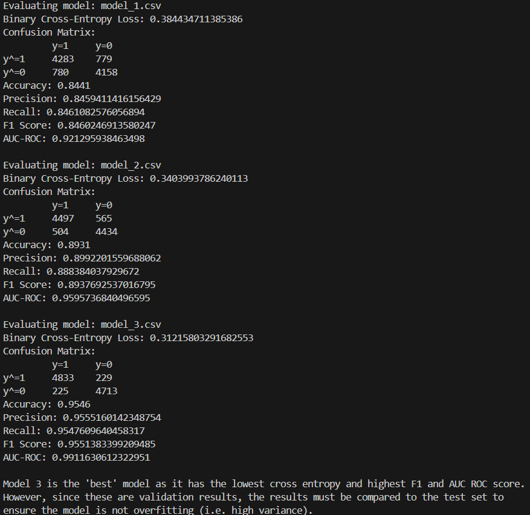

# ML Evaluation Metrics using Java
# Introduction
Machine Learning (ML) models are pivotal in modern software systems, necessitating rigorous testing to ensure reliability and performance. This lab focuses on evaluating ML models across three problem types: single-variable continuous regression, binary classification, and multiclass classification. For each, appropriate metrics—such as Mean Squared Error (MSE), Binary Cross-Entropy (BCE), and Cross-Entropy (CE) are implemented to assess accuracy and guide model selection.

# Discussion
Typically, accuracy is the only thing that we think about as humans when evaluating how something does in a classification task.  However, accuracy is often not enough to evaluate how well a model estimates the distribution of a dataset.  

Suppose that our dataset contains 5 points of class A and 95 points of class B.  Suppose that the result of the model is that it simply predicts everything as class B no matter the input.

### Accuracy
The accuracy metric is used in classification tasks.  It is simply the ratio of examples that the model correctly classified (of all classes) to the total number of datapoints.

$$\begin{align*}
Accuracy&=\frac{\text{Total number of points correctly classified}}{\text{Total number of datapoints}}
\\
&=\frac{TP+TN}{TP+TN+FP+FN}
\end{align*}$$

In the above example, **accuracy is 95% even though it doesn't learn anything meaningful!**  That is why we need recall and precision.

### Recall
Recall is the ratio of examples **of class A** that were correctly classified. It is useful when there is an imbalanced dataset.

$$\begin{align*}
Recall_\text{Class A} &= \frac{\text{Total number of points correctly classified as class A}}{\text{Total number of points that are actually class A}}
\\
&=\frac{TP}{TP+FN}
\end{align*}$$

In the above example, **Recall on class A in the above  example would be 0%!**

### Precision
On the other hand, precision computes the ratio of examples **classified as class A** that were correctly classified.  It is useful when there is an imbalanced dataset.

$$\begin{align*}
Precision_\text{Class A}&=\frac{\text{Total number of points correctly classified as Class A}}
{\text{Total number of points classified as Class A}}\\
&=\frac{TP}{TP+FP}
\end{align*}$$

In the above example, 
**Precision on class A in the above example would be 0%!**  Technically, since there are no points classified as class A in the above example, precision would be undefined.  However, it is conventionally treated as 0% in these situations.

# Results
### Single-variable Continuous Regression
3 models were compared in this section.  Their results are shown below.  Note that MAE, MSE, MARE are just different ways of calculating distances from each datapoint to the predicted function. \

### Single-variable Binary Regression
3 models were compared in this section.  Their results are shown below. Think of cross entropy as the suprise in the results that is obtained when estimating the ground truth distribution using each predicted model. F1 score is just the aggregation between precision and recall.  AUC-ROC is the probability that choosing a random point point of a positive class will be ranked higher than a negative class. \

### Multi-Class Classification
A single model was evaluated in this section.\
