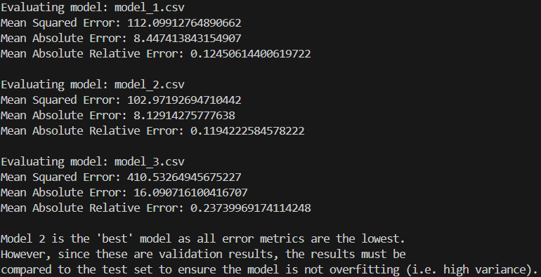

# ML Evaluation Metrics using Java
# Introduction
Machine Learning (ML) models are pivotal in modern software systems, necessitating rigorous testing to ensure reliability and performance. This lab focuses on evaluating ML models across three problem types: single-variable continuous regression, binary classification, and multiclass classification. For each, appropriate metrics—such as Mean Squared Error (MSE), Binary Cross-Entropy (BCE), and Cross-Entropy (CE) are implemented to assess accuracy and guide model selection.

# Results
### Single-variable Continuous Regression
3 models were compared in this section.  Their results are shown below.\

### Single-variable Binary Regression
3 models were compared in this section.  Their results are shown below.\

### Multi-Class Classification
A single model was evalulated in this section.\

# Discussion
Suppose that our dataset contains 5 points of class A and 5 95 points of class B.  Suppose that the result of the model is that it simply predicts everything as class B no matter the input.

### Accuracy
The accuracy metric is used in classification tasks.  It is simply the ratio of examples that the model correctly classified (of all classes) to the total number of datapoints.

$$Accuracy=\frac{\text{Points correctly classified}}{\text{Total number of datapoints}}$$

In the above example, accuracy is 95% even though it doesn't learn anything meaningful!  That is why we need recall and percision.

### Recall
Recall is the ratio of examples **of class A** that were correctly classified. It is useful when there is an imbalenced dataset.

$`Recall_\text{Class A} = \frac{\text{Points correctly classified as class A}}{\text{Points that are actually class A}}`$

In the above example, **Recall on class A in the above  example would be 0%!**

### Precision
On the other hand, precision computes the ratio of examples **classified as class A** that were correctly classified.  It is useful when there is an imbalenced dataset.
$` Precision_\text{Class A} = \frac{\text{\text{Points that are actually class A}}}{\text{Points classified as class A}} `$
In the above example, 
**Precision on class A in the above example would be 0%!**  Technically, since there are no points classified as class A in the above example, percision would be undefined.  However, it is conventionally treated as 0% in these situations.